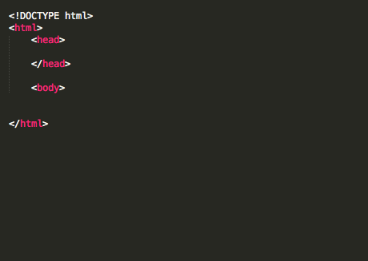

###### HCD v2.0
# Quiz: Introduction to HTML and CSS

----------------------------------

### Lesson + Instructor Info

_Lesson Title_*:   Quiz: Introduction to HTML and CSS

_Duration* (minutes)_:  20

### SME Info

_Portfolio/LinkedIn_:  http://saraheholden.com/

_Name_:  Sarah Holden

_Title_:  Web Developer & Web Designer

### Summary Messages

##### Learning Objectives*

* Test Your Knowledge!

----------------------------------

### Slideshow

_Prompt*_:  What does HTML stand for?

_Choices:*_

1. Human Tracheal Modulation Laryngoscope
2. Hybrid Terminal Meta Layout
* 3. HyperText Markup Language
4. How to Make Lasagna

_Explanation*_:  Indeed! HTML, or HyperText Markup Language, is the standard language used to code web pages.

----------------------------------

_Prompt*_:  What does CSS stand for?

_Choices:*_

1. Computer System Software
2. Commonly Scheduled Service
3. Cobra Starship Song
* 4. Cascading Style Sheets

_Explanation*_:  That's right! Cascading Style Sheets (CSS) is a style sheet language used to describe the presentation of content on the web.

----------------------------------

_Prompt*_:  Fill in the blanks:
HTML provides the _____________, CSS provides the _____________.

_Choices:*_

* 1. content  |  style
2. responsiveness  |  functionality
3. design  |  behavior
4. peanut butter  |  jelly

_Explanation*_:  Yippee! HTML is used in order to give structure to web sites, while CSS defines the style of the site.

----------------------------------

_Prompt*_:  Which of the following is a compelling reason to separate CSS from HTML?

_Choices:*_

1. Improve content accessibility
2. Share formatting across multiple pages
3. Increase flexibility
* 4. All of the above

_Explanation*_:  You got it! Separating CSS from HTML allows for improved content accessibility, increased flexibility, sharing formatting across multiple pages, and decreased repetition.

----------------------------------

_Prompt*_:  Which of the following is the correct pairing of tags with their correct application?

_Choices:*_

1. `<title>` : Defines the header for a document or section.  |  
`<a>` : Defines the hyperlink, or target destination for content in the document.  |  
`
` : Defines paragraphs in the document's body.  |  
`<h1>` : Defines a title for the document.
* 2. `<title>` : Defines a title for the document. |
`<a>` : Defines the hyperlink, or target destination for content in the document. |
`
` : Defines paragraphs in the document's body. |
`<h1>` : Defines the header for a document or section.
3. `<title>` : Defines the header for a document or section. |
`<a>` : Defines paragraphs in the document's body. |
`
` : Defines the hyperlink, or target destination for content in the document. |
`<h1>` : Defines a title for the document.
4. `<title>` : Defines a title for the document. |
`<a>` : Defines paragraphs in the document's body. |
`
` : Defines the hyperlink, or target destination for content in the document. |
`<h1>` : Defines the header for a document or section.

_Explanation*_:  Great! Your tags are all in order.

----------------------------------

_Prompt*_:  Which of the following is the correct syntax for an anchor tag, linking to www.ebay.com, with the anchor text "Buy This!"?

_Choices:*_

1. `<a href="http://www.ebay.com">eBay</a>`
* 2. `<a href="http://www.ebay.com">Buy This!</a>`
3. `<a rel="http://www.ebay.com">Buy This!</a>`
4. `<a target="http://www.ebay.com">Buy This!</a>`

_Explanation*_:  Exactly!

----------------------------------

_Prompt*_:  What does `<!DOCTYPE html>` indicate?

_Choices:*_

1. `<!DOCTYPE html>` indicates the main body text of the html file.
* 2. `<!DOCTYPE html>` indicates to the web browser that the document is written with HTML syntax.
3. `<!DOCTYPE html>` indicates to the text editor that the document is plain text.
4. `<!DOCTYPE html>` indicates the title of the html file.

_Explanation*_:  That's right! <!DOCTYPE html> is part of HTML the boilerplate (or standard starting syntax) that indicates to the web browser that the document is written in HTML.

----------------------------------

_Prompt*_:  Which of the following tags are missing from the above HTML boilerplate?

_Choices:*_

1. `<dog>`
2. `</h1>`
* 3. `</body>`
4. `
`

_Explanation*_:  Woohoo! You have a sharp eye for spotting holes in the code.

----------------------------------

_Prompt*_:  You want to make a change to an `<h1>` tag in your code and then see the results in a browser. Which is the correct order of steps to take?

_Choices:*_

1. 1. Navigate to the HTML file in the File System.  |  2. Open the HTML file with Google Chrome.   |  3. Update the <h1> text in Google Chrome.  |  4. Save the HTML file.  |  5. Navigate back to the HTML file in the File System.  |  6. Open the HTML file with Sublime Text.  |  7. See your changes in the text editor.
2. 1. Navigate to the HTML file in the File System.  |  2. Order a pizza.  |  3. Update the <h1> text in Sublime Text.  |  4. Pay pizza delivery guy.  |  5. Navigate back to the HTML file in the File System.  |  6. Enjoy a delicious cheesy slice.  |  7. See your changes in the browser.
3. 1. See your changes in the browser.  |  2. Open the HTML file with Sublime Text.  |  3. Open the HTML file with Google Chrome.  |  4. Save the HTML file.  |  5. Navigate back to the HTML file in the File System.  |  6. Update the <h1> text in Sublime Text.   |  7. Navigate to the HTML file in the File System.
* 4. 1. Navigate to the HTML file in the File System.  |  2. Open the HTML file with Sublime Text.  |  3. Update the <h1> text in Sublime Text.  |  4. Save the HTML file.  |  5. Navigate back to the HTML file in the File System.  |  6. Open the HTML file with Google Chrome.  |  7. See your changes in the browser.

_Explanation*_:  Perfect! You're ready to start coding and seeing your work in the browser!

----------------------------------

_Prompt*_:  Let's say we wanted to change the background color of our page to yellow (`#FFFF00`). Which of the following would be the correct way to do this?

_Choices:*_

1. `<body>background-color: #FFFF00 </body>`
2. `body {pizza: cheese}`
* 3. `body {background-color: #FFFF00 ;}`
4. `h1 {background-color: #FFFF00;}`

_Explanation*_:  Correct! We can use the body selector to change the color of the entire webpage.

----------------------------------

_Prompt*_:  Let's say we wanted to change the background color of our page to yellow (`#FFFF00`). Which of the following would be the correct way to do this?

_Choices:*_

1. `<body>background-color: #FFFF00 </body>`
2. `body {pizza: cheese}`
* 3. `body {background-color: #FFFF00 ;}`
4. `h1 {background-color: #FFFF00;}`

_Explanation*_:  Correct! We can use the body selector to change the color of the entire webpage.

----------------------------------
