###### HCD v2.0
# Lesson 1: HTML Basics

---

### Lesson + Instructor Info

|                         |                                           |
| ----------------------- | ----------------------------------------- |
| _Lesson Title_*         | Lesson 1: HTML Basics |
| _Duration* (minutes)_   | 20 |
| _Instructor Image_      | |


### SME Info

|                         |                                         |
| ----------------------- | --------------------------------------- |
| _Portfolio/LinkedIn_    | http://saraheholden.com/ |
| _Name_                  | Sarah Holden |
| _Title_                 | Web Developer & Web Designer |


### Summary Messages

##### Learning Objectives*

* Apply markup to existing content using HTML content tags
* Demonstrate understanding of tags, their components and how to use them
* Demonstrate understanding of HTML Formatting
* Use HTML5 content tags to add content to a webpage: h1-h6, p, a, ul/ol
* Describe how attributes relate to elements
* Understand the basic HTML boilerplate, why it’s necessary, and how to apply it
* Write HTML that gets rendered as a document in the browser

---

### Slideshow

Okay. Now that we know how HTML and CSS fit into the web development ecosystem and have learned how to create a basic project with an HTML file, let's dig in a little bit more.

---

In web development, we always start by creating the structure for our pages using HTML.

In this lesson, we’ll dive deeper into basic HTML Syntax and look at how we'll use HTML to structure our content and build web sites.

---

When writing HTML, it is helpful to start by thinking about how we'd like each piece of content to be formatted on our site.

---

> GRAPHICS NOTE: The NYT mockups below should do for this portion, but if there's time and resources it would be awesome to come up with a simpler graphic of a webpage that contains these different pieces of content.

Should the content be displayed as a heading?

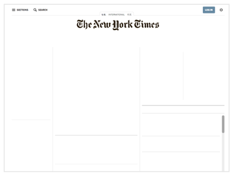

---

A subheading?

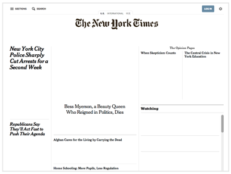

---

A paragraph?

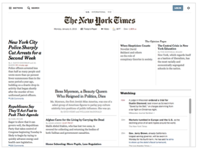

---

An image?

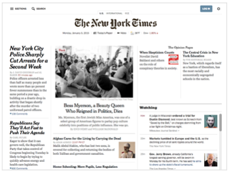

---

After we've identified the role a piece of content plays on our site, we can then use HTML tags to tell our browser how to format this content. Let's take a look at how to add tags to our content to create a structure for our page in this video.

---

_Video Title_:  HTML Elements

_Video Content*_:  Video in Production

_Transcript_:  [Video Script](videos/scripts/html-elements.md)

---

Let’s kick-off our journey into the many tags of HTML with some text formatting tags.

---

Let's pretend we want to create a portfolio site for a web developer named Anna Smith.

Here's the content for our site:

> Note: This will be a codepen embed: Codepen Link: https://codepen.io/sarahholden/pen/VbyQLo?editors=1000#

```html
Anna Smith

About Me

I'm Anna Smith, a Developer based in San Francisco.  I Have ten years of experience in the graphic design world, specializing in the creation of responsive websites.

Experience

I recently graduated from a Front-End Web Development course at General Assembly where I learned HTML, CSS, JavaScript, and jQuery and how to be an awesome Front-End Web Developer! During my spare time, I enjoy painting, cooking, and hiking.

```

---

If we open this file in the browser without adding any HTML tags, the content will have no formatting. Here's what it will look like in the browser:

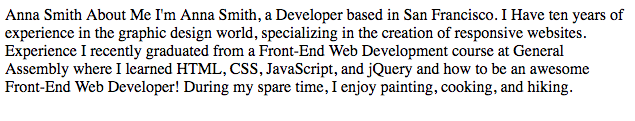

---

Let's discover how we could add some structure to this site.

It is important to keep in mind that when we are writing HTML, we are thinking about the _structure_ of the content. We can always change how each element is _styled_ later using CSS.


---


Each piece of content on our page should be surrounded by some sort of tags.

---

First let's take a look at **heading tags**.

There are six levels of heading tags we can use on our pages. These rank from `h1` through `h6`.

```html
<h1>Heading 1</h1>
<h2>Heading 2</h2>
<h3>Heading 3</h3>
<h4>Heading 4</h4>
<h5>Heading 5</h5>
<h6>Heading 6</h6>
```

---

By default, our browser will display these headings in decreasing size, `h1` being the largest and `h6` the smallest.

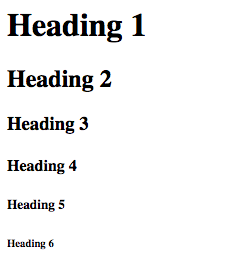

---

The level of the heading you use should match the importance of the text.

Generally speaking, the `h1` tag is usually reserved for a site's title.

`<h1>Site Title</h1>`

---

`h2` through `h6` headings are used for subheadings.

`<h2>Subheading</h2>`

---

Creating a hierarchy with headings not only helps organize a site, but it also helps search engines know which content is most important, which can increase the search ranking of a site in search engines like Google.

---

Now it's your turn to get some practice!

Now let's return to our portfolio site. Since "Anna Smith" seems to be the main title, start by wrapping that text with an opening and closing `h1` tag.

> Note (continued): This will be a codepen embed: Codepen Link: https://codepen.io/sarahholden/pen/VbyQLo?editors=1000#

---

Great! Check to make sure that your `h1` looks like this:

```html
<h1>Anna Smith</h1>

<!-- Rest of content -->
```

---

It looks like "About Me" and "Experience" are sub-headers. They look slightly less important than the `h1`, and look like they may have the same level of importance.

---

Wrap the text "About Me" and "Experience" with opening and closing `h2` tags.

> Note (continued): This will be a codepen embed: Codepen Link: https://codepen.io/sarahholden/pen/VbyQLo?editors=1000#

---

Great! Check to make sure your code now look like this:


```html
<h1>Anna Smith</h1>

<h2>About Me</h2>

I'm Anna Smith, a Developer based in San Francisco.  I Have ten years of experience in the graphic design world, specializing in the creation of responsive websites.

<h2>Experience</h2>   

<!-- Rest of content -->

```

---

Now things are looking much better!

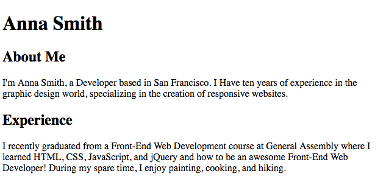

---


Next we'll need to provide some structure for the paragraphs on our page. We can do so using **paragraph tags**.

---

The most basic content tag in HTML is the paragraph tag, or `p` tag. It indicates blocks, or "paragraphs" of text.

```html
<p>Hello from the paragraph of text.</p>
```

---

Let's continue to add structure to our portfolio site. Give it a shot by wrapping the two paragraphs of text with opening and closing `p` tags.

> Note (continued): This will be a codepen embed: Codepen Link: https://codepen.io/sarahholden/pen/VbyQLo?editors=1000#

---

You're on a roll! Check to make sure that your code now looks like this:


```html
<h1>Anna Smith</h1>

<h2>About Me</h2>

<p>I'm Anna Smith, a Developer based in San Francisco.  I Have ten years of experience in the graphic design world, specializing in the creation of responsive websites.</p>

<h2>Experience</h2>

<p>I recently graduated from a Front-End Web Development course at General Assembly where I learned HTML, CSS, JavaScript, and jQuery and how to be an awesome Front-End Web Developer! During my spare time, I enjoy painting, cooking, and hiking.</p>

```

---

In the preview window you may notice that the text styles did not change when you wrapped those paragraphs with `p` tags, but now we are correctly providing structure for the paragraphs on our site.


---

When writing HTML we are focusing on adding _structure_ to our content, _not_ style.

Even if we don't notice that any styles have changed as we add in content, all of the content on our page should be wrapped by some sort of tags.

The browser doesn't understand content that's not marked up wtih HTML. When we add content to the page, we have to define its purpose for being there.

---

Alright! Now let's learn how we could add a list to our site.

---

To create an unordered, or bulleted, list we would use `ul` tags. **Unordered list** tags are used anytime the order of the items in the list is _not_ important.

> SME Note: Indentation is important for the following code snippets!

```html
<ul></ul>

```

---

Each individual item that is a part of the list should be surrounded by `li`, or **list item**, tags:

```html
<ul>
	<li>Chocolate</li>
	<li>Strawberry</li>
	<li>Vanilla</li>
</ul>

```

---

Notice that all of the items that we want to be part of a list are placed between the opening and closing `ul` tags.

```html
<ul>
	<li>Chocolate</li>
	<li>Strawberry</li>
	<li>Vanilla</li>
</ul>

```

---

It is best practice to _indent_ elements that are wrapped by another element. This not only makes our HTML easier to read, but also allows us to easily scan and make sure that we haven't forgotten the closing `ul` tag.

```html
<ul>
	<li>Chocolate</li>
	<li>Strawberry</li>
	<li>Vanilla</li>
</ul>

```
---

To create an ordered, or numbered, list, we would use `ol` tags. An **ordered list** is used anytime the order of the items in the list _is_ important.

```html
<ol>
	<li>Wake up</li>
	<li>Brew coffee</li>
	<li>Go to work</li>
<ol>

```

---

Let's take a look at how we could add a list to our portfolio site. Take a look at this new content:


> Content added at the end of this Codepen: https://codepen.io/sarahholden/pen/mmpXWV?editors=1000#

```html
Skills

HTML
CSS
jQuery
JavaScript
Responsive Design
```
---

It looks like the text "Skills" is probably a heading. Let's assume that this header is a little less important than our existing headings. Wrap the text "Skills" with an opening and closing `h3` tag.

---

Does your code look like this?

```html
<h3>Skills</h3>

HTML
CSS
jQuery
JavaScript
Responsive Design
```

---

And now for our list! Wrap the entire list with an opening and closing `ul` tag. The wrap each list item with an opening and closing `li` tag.

---

Does your code look like this?

```html
<h3>Skills</h3>

<ul>
	<li>HTML</li>
	<li>CSS</li>
	<li>jQuery</li>
	<li>JavaScript</li>
	<li>Responsive Design</li>
</ul>
```

---

If you check out the preview window, you'll notice that we now have a bulleted list!

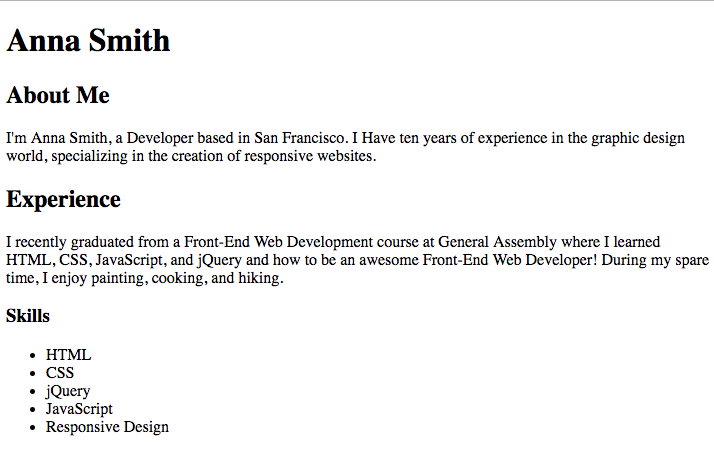

---

Nice work! Now let's learn how to create a link to another site.

---

To create a link to another site, we'll need to use the anchor, or `a`, element.

`<a>Clickable Text</a>`


---

But we're missing something! We have surrounded the content we want to turn into a link with `a` tags, but we need to tell our browser *where* that link should take the user when they click on the link. To do so, we'll need to add an *attribute* to our link.

---

What's an attribute? Watch this video to find out:

_Video Title_:  HTML Attributes

_Video Content*_:  Video in Production

_Transcript_:  [Video Script](https://docs.google.com/document/d/1vbFrlgv98DeSsoJg3-4d9qnKMo5yPYZdrLGn-xGx_JE/edit)


---

Alright! Now it's your turn to practice by adding an anchor to our portfolio site.

---

First wrap the text "General Assembly" by an opening and closing anchor tag.

> Codepen (continued): https://codepen.io/sarahholden/pen/mmpXWV?editors=1000#

---

Does your code look like this?


```html
<a>General Assembly</a>
```

---

Great! Now add an `href` attribute within the opening `a` tag, providing the following url as a value: `https://generalassemb.ly/`.

---

Does your code look like this?


```html
<a href="https://generalassemb.ly/">General Assembly</a>
```


---

Here's what this anchor should look like inside of the paragraph surrounding it:

```html
<p>I recently graduated from a Front-End Web Development course at <a href="http://generalassemb.ly/">General Assembly</a> where I learned...</p>
```


---

If you take a look in the preview window, you'll notice the text "General Assembly" is now formatted as an anchor:

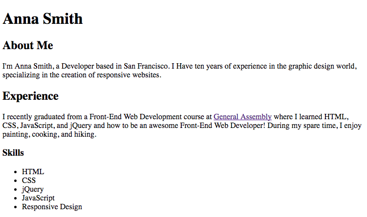

---

Awesome! Now that we've covered some basic tags that we can use to provide structure to content, let's zoom out and take a look at the broader structure of an HTML file. This is often referred to as the "HTML boilerplate."

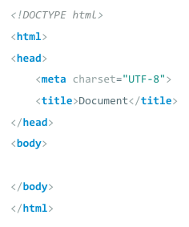

---

The doctype tells the browser which version of HTML the file is written in. `<!DOCTYPE html>` is used for HTML5, the latest version of HTML.

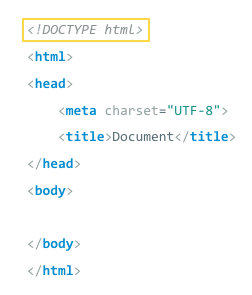


---

All of the HTML code for the page should be wrapped by an opening and closing `html` tag:

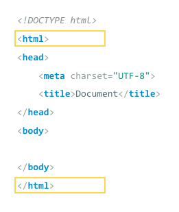


---

The `head` tag is used for behind-the-scenes info used by the browser and search engines. None of the content within the `head` will be visible in the browser window.

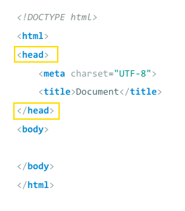

---

The `charset` tag is used to tell the browser which character set to use. This should always be `UTF-8`.

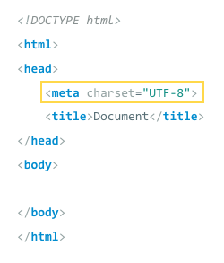


---

The `title` tag tells the browser what the site is called. This info is often displayed in the browser tab, is used for browser bookmarks, and is used by search engines.


---

Everything we want to be displayed in the browser window gets placed within the `body` tags.

If you want something to be visible in the browser window &mdash; a paragraph, heading, image, anchor, etc. &mdash; it should go within the body tags.


---

Feel like a lot to type out?

Many text editors have a shortcut for auto-filling this boilerplate. In Sublime, typing `html` and then hitting the `tab` key should auto-fill this HTML boilerplate for you. Then you can simply fill in the title, and add the rest of your HTML content within the `body` tags.

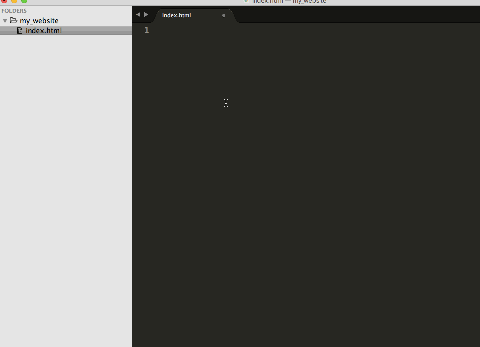

---

In this lesson we've taken the first step towards creating beautiful websites. We learned how to provide structure to the content on our sites using HTML.

---

Now it's your turn to get some practice in the code challenge!
