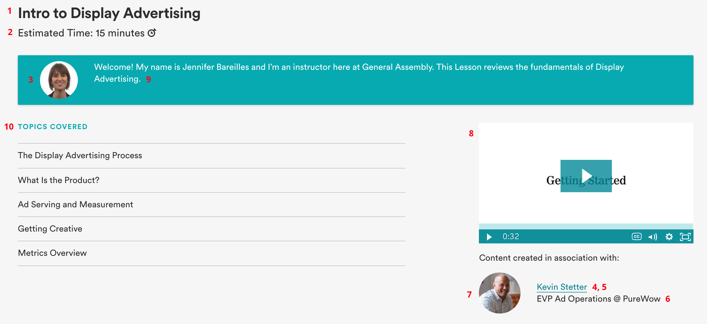
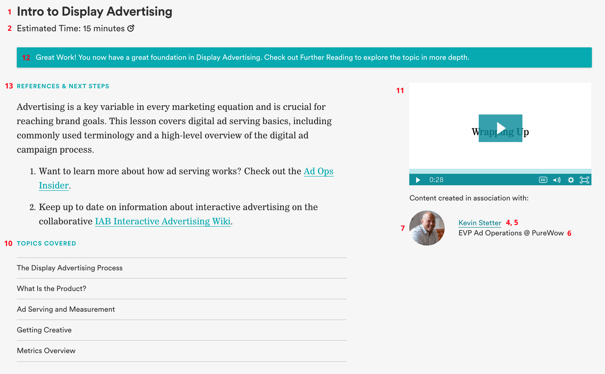

# LP Templates

----------------------------------

## Overview
Below are the Intro and Outro screens seen at the beginning and end of each lesson. It may be helpful to familiarize yourself with the contents of these screens before filling out the template.

### Intro Screens
Content in your template mimics the order the Data Entry person will generate JSON, and not necessarily the order of the content from top to bottom. Please refer to the numbered list below for more explanation.

1. Lesson Title
2. Lesson Duration
3. Instructor Image
4. SME Portfolio or LinkedIn Profile
5. SME Name
6. SME Title
7. SME Image
8. Intro Video
9. Intro Message
10. Learning Objectives
11. Outro Video
12. Outro Message
13. References & Next Steps

**NOTE**: Some content is repeated between intro and outro screens, but only needs to be added once.
